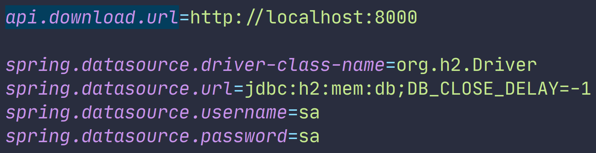

The plugin is archived and not supported anymore.

IDEA Code Screenshoter
===

Simple IDEA plugin which allows you to take code screenshots. Just select code block and press `Ctrl+Alt+Shift+A` (`Option+Shift+Command+A`
on macOS). Alternatively you may save screenshots as PNG files using **Save image as** action (no hot-key by default, but can be assigned via **Keymap**).

Installation page is [here](https://plugins.jetbrains.com/idea/plugin/9406-code-screenshots).

### Example
<h3 align=center></h3>
<h3 align=center></h3>
